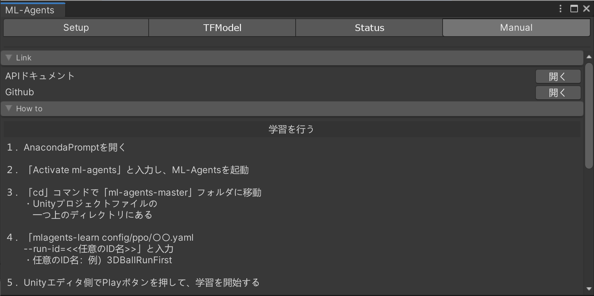
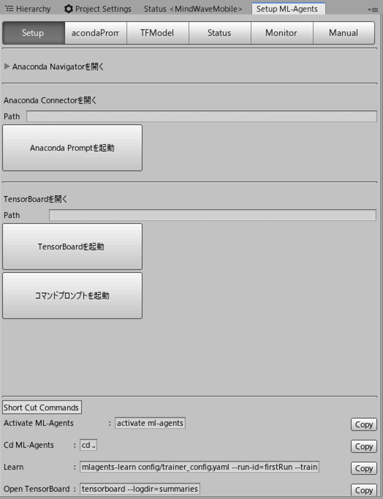
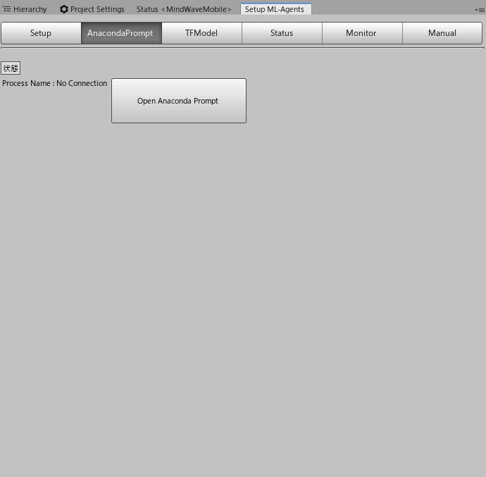
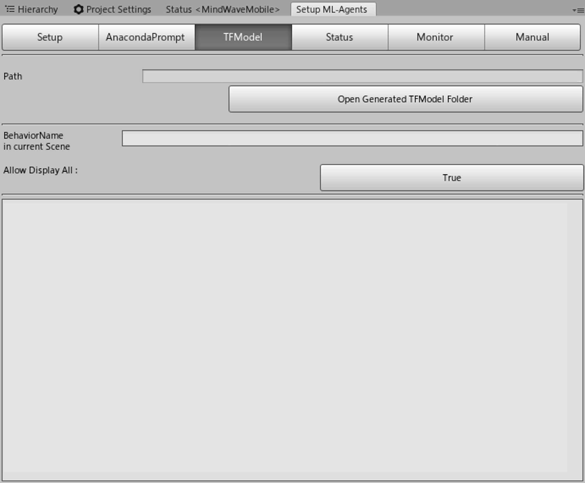
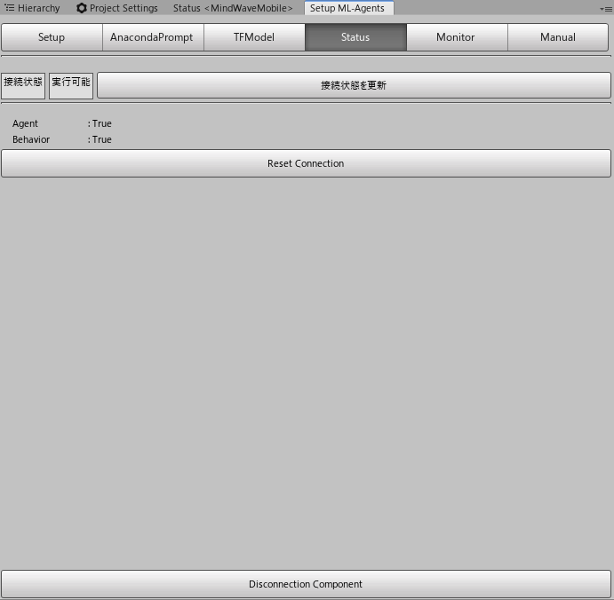
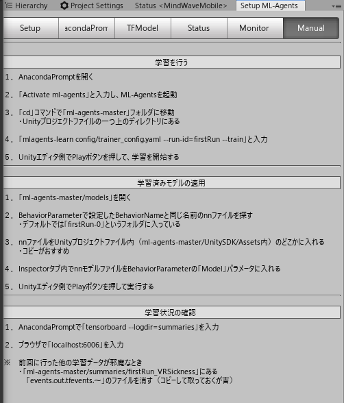

<!-- omit in toc -->
# Unity-ML-Agents-Debugger

<!-- バッジの表示 -->

<!-- omit in toc -->
# 目次 (Index)
- [概要 (Overview)](#概要-overview)
- [機能一覧 (Function Lists)](#機能一覧-function-lists)
- [インストール手順 (How to install)](#インストール手順-how-to-install)
- [ライセンス (License)](#ライセンス-license)
- [その他／注意事項　（Notes）](#その他注意事項notes)

# 概要 (Overview)

# 機能一覧 (Function Lists)
| 機能            | 画像                                                                    | 内容                                                                                                                                                                                                                                                                                |
| :-------------- | :---------------------------------------------------------------------- | :---------------------------------------------------------------------------------------------------------------------------------------------------------------------------------------------------------------------------------------------------------------------------------- |
| Setup           |                    | ML-Agentsの学習開始に必要な外部ソフトのショートカットやコマンドをまとめています。 上から順にボタンを押せばスムーズに学習が始められるようなレイアウトになっています。                                                                                                             |
| Anaconda Prompt |  | 強化学習に利用するライブラリをまとめたソフトの管理を行う「Anaconda Prompt」のショートカットを設定しています。                                                                                                                                                                       |
| TF Model        |                | 学習後に生成された推論モデルのファイルを確認することができます。                                                                                                                                                                                                                    |
| Status          |                  | Unityエディタで現在の編集シーン内に学習に必要なオブジェクトが用意されているかどうかを確認することができます。 実行可能な場合は画面の左上の表示が「実行可能」になります。 シーン中に「Agent」「Behavior」が存在しない場合は「False」になり何が不足しているのかを確認できます。 |
| Manual          |                  | ML-Agentsの使い方を記した説明用の画面です。 「学習時」、「推論モデルの使い方」、「学習状況の確認の仕方」を書き記しています。                                                                                                                                                     |

# インストール手順 (How to install)
本リポジトリを利用するには「Unity ML-Agents」の環境が構築されたUnityプロジェクトデータが必要です。 
本リポジトリのソースコードをインポートする前に必ず環境構築を行ってください。

# ライセンス (License)
本リポジトリはMITライセンスによって提供されています。 
> [MITライセンスの内容について](LICENSE)

# その他／注意事項　（Notes）
このリポジトリはあくまで研究用として個人的に利用しているものです。 個人で利用できる範囲内で環境を整えているので、クローンしても動かない可能性があります。 あらかじめご注意ください。

This repository is only for my personal use. This repository is not designed to be used by others, so it may not work even if you clone it. Please be aware of this in advance.